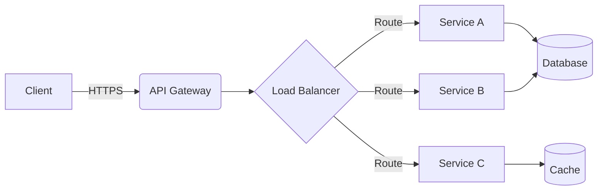

<!-- SLIDE 1 - Cover -->
<div class="flex flex-col items-center justify-center h-full">
  <p class="nc-label mb-3">NeoCarbon Theme · Showcase</p>

  <h1 style="font-size: 2.4rem !important; font-weight: 700; letter-spacing: -0.02em; line-height: 1.2;">
    Premium Dark Presentations
  </h1>
  <p style="color: var(--nc-accent) !important; font-size: 1.4rem; font-weight: 700; margin-top: 0.25rem;">
    Made Beautiful
  </p>

  <p style="color: rgba(255,255,255,0.45) !important; font-size: 0.85rem; max-width: 32rem; margin-top: 1rem; line-height: 1.6;">
    <strong style="color: rgba(255,255,255,0.8) !important;"><NcAnimatedCounter :to="22" suffix=" layouts" /></strong> ·
    <strong style="color: rgba(255,255,255,0.8) !important;"><NcAnimatedCounter :to="25" suffix=" components" /></strong> ·
    Cinematic animations
  </p>

  <p style="color: rgba(255,255,255,0.2) !important; font-size: 0.7rem; margin-top: 2.5rem;">
    slidev-theme-neocarbon · v1.0.0
  </p>
</div>

---
layout: section
---

# Layouts
Building blocks for every slide type

---
layout: intro
---

# Jane Doe
**Lead Engineer** at NeoCarbon Corp

- 10+ years software architecture
- AI & ML infrastructure specialist
- Open source contributor & speaker

---
layout: statement
---

# Every pixel should have purpose.

Good design is invisible. Great design is unforgettable.

---
layout: quote
---

The best way to predict the future is to invent it.

— Alan Kay

---
layout: fact
---

# 47.5M €
Estimated savings over 3 years with a single infrastructure investment

---
layout: comparison
---

::left::

### ❌ Status Quo

<div class="space-y-2 mt-3">
  <div class="nc-card" style="padding: 8px 12px;">
    <p style="font-size: 0.72rem; color: rgba(255,255,255,0.6) !important;">PoCs: <strong style="color:white !important;">2–3 Weeks</strong></p>
  </div>
  <div class="nc-card" style="padding: 8px 12px;">
    <p style="font-size: 0.72rem; color: rgba(255,255,255,0.6) !important;">Cost: <strong style="color:white !important;">6,000–9,000 €</strong></p>
  </div>
</div>

::right::

### ✅ Future State

<div class="space-y-2 mt-3">
  <div class="nc-card" style="padding: 8px 12px; border-color: rgba(74,222,128,0.15);">
    <p style="font-size: 0.72rem; color: rgba(255,255,255,0.6) !important;">PoCs: <strong style="color:white !important;">2–3 Days</strong></p>
  </div>
  <div class="nc-card" style="padding: 8px 12px; border-color: rgba(74,222,128,0.15);">
    <p style="font-size: 0.72rem; color: rgba(255,255,255,0.6) !important;">Cost: <strong style="color:white !important;">~1,500 €</strong></p>
  </div>
</div>

---
layout: split-heading
---

::left::

# Magazine
# Layout

This heading stays pinned while the content flows on the right.

::right::

<div class="space-y-2.5">
  <div class="nc-card flex items-start gap-3">
    <div class="nc-icon-sm"><carbon-star class="text-white" /></div>
    <div>
      <p style="font-size: 0.78rem; font-weight: 700; color: white !important;">Premium Design</p>
      <p style="font-size: 0.65rem; color: rgba(255,255,255,0.4) !important;">Magazine-style split heading with visual hierarchy.</p>
    </div>
  </div>
  <div class="nc-card flex items-start gap-3">
    <div class="nc-icon-sm"><carbon-flash class="text-white" /></div>
    <div>
      <p style="font-size: 0.78rem; font-weight: 700; color: white !important;">Accent Divider</p>
      <p style="font-size: 0.65rem; color: rgba(255,255,255,0.4) !important;">Vertical gradient accent line separates the two sections.</p>
    </div>
  </div>
  <div class="nc-card flex items-start gap-3">
    <div class="nc-icon-sm"><carbon-flow class="text-white" /></div>
    <div>
      <p style="font-size: 0.78rem; font-weight: 700; color: white !important;">Flexible Content</p>
      <p style="font-size: 0.65rem; color: rgba(255,255,255,0.4) !important;">Right panel supports any markup — cards, charts, code.</p>
    </div>
  </div>
</div>

---
layout: section
---

# Components
Reusable building blocks with wow-effect

---

# Feature Grid & Marquee

<NcFeatureGrid class="mt-3" :features="[
  { icon: '🚀', title: 'Lightning Fast', description: 'Sub-second build times' },
  { icon: '🔒', title: 'Secure', description: 'Zero-trust by default' },
  { icon: '📊', title: 'Analytics', description: 'Real-time dashboards' },
  { icon: '🌍', title: 'Global CDN', description: 'Edge deployment' },
  { icon: '🤖', title: 'AI-Powered', description: 'Smart automation' },
  { icon: '🔌', title: 'Plugin System', description: 'Infinitely extensible' },
]" :columns="3" />

<NcMarquee class="mt-3" :items="['TypeScript', 'React', 'Vue', 'Rust', 'Go', 'Python', 'Docker', 'Kubernetes', 'AWS', 'Terraform']" :speed="25" />

---

# Steps & Process

<div class="grid grid-cols-2 gap-6 mt-3">
  <div>
    <p class="nc-label mb-2">Implementation Plan</p>
    <NcSteps :steps="[
      { title: 'Requirements', description: 'Gather & document', done: true },
      { title: 'Architecture', description: 'System design review', done: true },
      { title: 'Development', description: 'Build MVP sprint', active: true },
      { title: 'Testing', description: 'QA & load testing' },
      { title: 'Deployment', description: 'Production rollout' },
    ]" />
  </div>
  <div>
    <p class="nc-label mb-2">Terminal Output</p>
    <NcTerminal title="~/project">
      <div><span class="nc-term-prompt">$</span> bun run build</div>
      <div><span class="nc-term-dim">→ Compiling 142 modules...</span></div>
      <div><span class="nc-term-success">✓ Build complete in 1.2s</span></div>
      <div><span class="nc-term-dim">→ Bundle size: 48.3 KB (gzipped)</span></div>
      <div><span class="nc-term-prompt">$</span> bun run deploy --prod</div>
      <div><span class="nc-term-info">ℹ Deploying to edge network...</span></div>
      <div><span class="nc-term-success">✓ Live at https://app.example.com</span></div>
    </NcTerminal>
  </div>
</div>

---

# Stat Cards & Progress

<div class="grid grid-cols-4 gap-3 mt-3">
  <NcStatCard value="99.9%" label="Uptime" icon="🟢" color="white" />
  <NcStatCard value="42K" label="Active Users" icon="👥" color="var(--nc-success)" borderColor="var(--nc-success)" />
  <NcStatCard value="3.2s" label="Avg Response" icon="⚡" color="var(--nc-info)" borderColor="var(--nc-info)" />
  <NcStatCard value="6.2×" label="ROI" icon="📈" color="var(--nc-warning)" borderColor="var(--nc-warning)" />
</div>

<NcDivider label="Skills" accent class="mt-3" />

<div class="grid grid-cols-2 gap-x-6 gap-y-2 mt-2">
  <NcProgress label="TypeScript" :value="95" />
  <NcProgress label="Infrastructure" :value="72" color="var(--nc-success)" />
  <NcProgress label="React / Vue" :value="88" color="var(--nc-info)" />
  <NcProgress label="Machine Learning" :value="60" color="var(--nc-warning)" />
</div>

---

# Timeline & Badges

<p class="nc-label mb-3">Implementation Roadmap</p>

<NcTimeline class="mt-4" :items="[
  { label: 'Q1–Q2', title: 'Procurement', description: 'Hardware setup', color: '#E30613' },
  { label: 'Q3', title: 'Pilot', description: '50 users', color: '#ff4444' },
  { label: 'Q4', title: 'Rollout', description: '500 users', color: '#ff6666' },
  { label: 'Q1+', title: 'Full Scale', description: '1,200 users', color: '#4ade80', active: true },
]" />

<NcDivider class="mt-5 mb-3" />

<div class="flex items-center gap-2 flex-wrap">
  <NcBadge type="accent" glow>Accent</NcBadge>
  <NcBadge type="success">Success</NcBadge>
  <NcBadge type="warning">Warning</NcBadge>
  <NcBadge type="danger" glow>Critical</NcBadge>
  <NcBadge type="info">Info</NcBadge>
  <NcBadge type="neutral">Neutral</NcBadge>
</div>

---

# Callouts & Keyboard

<div class="space-y-2.5 mt-3">
  <NcCallout type="info" title="Keyboard Shortcuts">
    Press <NcKbd>⌘</NcKbd> + <NcKbd>K</NcKbd> to search · <NcKbd>Esc</NcKbd> to close · <NcKbd>↑</NcKbd> <NcKbd>↓</NcKbd> to navigate
  </NcCallout>

  <NcCallout type="success" title="Build Passed">
    All <strong>142 tests</strong> passed. Coverage: <strong>94.2%</strong>. Ready for deployment.
  </NcCallout>

  <NcCallout type="warning" title="Performance Alert">
    Memory usage at <strong>82%</strong>. Consider scaling the cluster before launch.
  </NcCallout>

  <NcCallout type="accent" title="Pro Tip">
    Combine callouts with <code>v-click</code> for progressive reveals during your presentation.
  </NcCallout>
</div>

---

# Window & Glow

<div class="grid grid-cols-2 gap-3 mt-3">
  <div>
    <NcWindow title="api/handler.ts">
      <pre style="font-size: 0.72rem; line-height: 1.7; color: rgba(255,255,255,0.7); margin:0; background:transparent !important; border:none !important; padding: 0 !important;">
<span style="color: #c586c0;">export async function</span> <span style="color: #dcdcaa;">handler</span>(req: Request) {
  <span style="color: #c586c0;">const</span> data = <span style="color: #c586c0;">await</span> req.json()
  <span style="color: #c586c0;">const</span> result = <span style="color: #c586c0;">await</span> ai.complete(data)
  <span style="color: #c586c0;">return</span> Response.json(result)
}</pre>
    </NcWindow>
  </div>

  <div class="flex items-center justify-center">
    <NcGlow :size="200" :intensity="0.15">
      <div style="text-align: center;">
        <p style="font-size: 2.5rem;">🚀</p>
        <p style="font-size: 0.85rem; font-weight: 700; color: white !important; margin-top: 8px;">Ship It</p>
        <p style="font-size: 0.65rem; color: rgba(255,255,255,0.4) !important;">Production-ready</p>
      </div>
    </NcGlow>
  </div>
</div>

---
layout: section
---

# Slidev Features
Mermaid · KaTeX · Code

---
layout: code
---

# TypeScript Example

```ts
function fibonacci(n: number): number {
  if (n <= 1) return n;
  
  let prev = 0, curr = 1;
  for (let i = 2; i <= n; i++) {
    [prev, curr] = [curr, prev + curr];
  }
  return curr;
}

// Usage
const result = fibonacci(42);
console.log(`F(42) = ${result}`);
// → F(42) = 267914296
```

---

# Mermaid Diagram

<div class="mt-3">



</div>

<div class="nc-glass mt-3" style="padding: 8px 14px;">
  <p style="font-size: 0.7rem; color: rgba(255,255,255,0.5) !important;">
    <strong style="color: var(--nc-accent) !important;">Note:</strong> Mermaid diagrams are automatically styled to match the NeoCarbon dark theme.
  </p>
</div>

---

# KaTeX Math

<p class="nc-label mb-2">Euler's Identity</p>

$$
e^{i\pi} + 1 = 0
$$

<p class="nc-label mb-2 mt-4">Normal Distribution</p>

$$
f(x) = \frac{1}{\sigma\sqrt{2\pi}} \exp\left(-\frac{(x-\mu)^2}{2\sigma^2}\right)
$$

<div class="nc-glass mt-4" style="padding: 8px 14px;">
  <p style="font-size: 0.68rem; color: rgba(255,255,255,0.4) !important;">
    KaTeX formulas use white text and integrate naturally with the dark background.
    Use the <code>math</code> layout for a dedicated centered formula slide.
  </p>
</div>

---
layout: section
---

# Charts
Data visualization components

---

# Line Chart

<div class="mt-2 flex-1">
  <NcLineChart
    title="Monthly Growth"
    :labels="['Jan', 'Feb', 'Mar', 'Apr', 'May', 'Jun', 'Jul', 'Aug']"
    :datasets="[
      { label: 'Revenue', data: [2.1, 2.8, 3.2, 4.1, 4.8, 5.5, 6.2, 7.1], color: '#E30613' },
      { label: 'Costs', data: [3.0, 2.9, 2.8, 2.7, 2.6, 2.5, 2.4, 2.3], color: '#60a5fa' },
    ]"
    yLabel="Millions €"
    :height="260"
  />
</div>

---

# Bar & Pie Charts

<div class="flex gap-3 mt-2 flex-1">
  <div class="flex-1">
    <NcBarChart
      title="Revenue by Quarter (M€)"
      :labels="['Q1', 'Q2', 'Q3', 'Q4']"
      :data="[2.4, 3.8, 5.1, 7.2]"
      :colors="['#E30613', '#ff4444', '#4ade80', '#60a5fa']"
      :height="200"
    />
  </div>
  <div class="flex-1">
    <NcPieChart
      title="Budget Allocation"
      :labels="['Engineering', 'Marketing', 'Operations', 'R&D']"
      :data="[45, 20, 15, 20]"
      :colors="['#E30613', '#ff4444', '#ff6666', '#ff8888']"
      :height="200"
    />
  </div>
</div>

---

# CSS Utility Classes

<div class="grid grid-cols-2 gap-3 mt-3">
  <div>
    <p class="nc-label mb-2">Cards</p>
    <div class="nc-card mb-2" style="padding: 10px;">
      <p style="font-size: 0.7rem; color: white !important;"><code>nc-card</code> — hover to see the lift</p>
    </div>
    <div class="nc-glass mb-2" style="padding: 10px;">
      <p style="font-size: 0.7rem; color: white !important;"><code>nc-glass</code> — frosted glass panel</p>
    </div>
    <div class="nc-highlight" style="padding: 10px;">
      <p style="font-size: 0.7rem; color: white !important;"><code>nc-highlight</code> — shimmer accent card</p>
    </div>
  </div>
  <div>
    <p class="nc-label mb-2">Text Colors</p>
    <div class="space-y-1" style="font-size: 0.75rem; font-weight: 600;">
      <p class="nc-text-accent">nc-text-accent — Brand</p>
      <p class="nc-text-success">nc-text-success — Positive</p>
      <p class="nc-text-warning">nc-text-warning — Warning</p>
      <p class="nc-text-danger">nc-text-danger — Danger</p>
      <p class="nc-text-info">nc-text-info — Info</p>
      <p class="nc-text-muted">nc-text-muted — Secondary</p>
      <p class="nc-text-dim">nc-text-dim — Tertiary</p>
    </div>
  </div>
</div>

---
layout: section
---

# Creative Layouts
Out-of-the-box slides

---
layout: spotlight
---

# We just raised €50M

Series B led by top-tier venture capital — fueling the next chapter of innovation.

---
layout: browser
url: https://app.neocarbon.io/dashboard
---

<div style="text-align: center; padding: 1.5rem 0;">
  <p class="nc-label mb-2">Live Dashboard Preview</p>
  <div class="grid grid-cols-3 gap-3 mt-3">
    <NcStatCard value="2,847" label="Active Sessions" icon="🟢" color="var(--nc-success)" />
    <NcStatCard value="99.97%" label="Uptime" icon="⚡" />
    <NcStatCard value="18ms" label="P95 Latency" icon="📊" color="var(--nc-info)" />
  </div>
  <NcTicker class="mt-3" :items="[
    { label: 'Revenue', value: '€47.5M', change: 12.4 },
    { label: 'MRR', value: '€3.8M', change: 8.2 },
    { label: 'Churn', value: '0.8%', change: -15.1 },
    { label: 'NPS', value: '78', change: 4.3 },
  ]" />
</div>

---
layout: section
---

# Creative Components
Interactive · Animated · Data-driven

---

# Typewriter & Chat

<div class="grid grid-cols-2 gap-6 mt-3">
  <div>
    <p class="nc-label mb-2">Typewriter Effect</p>
    <div class="nc-glass" style="padding: 16px; font-size: 0.85rem; font-family: 'Fira Code', monospace; min-height: 140px;">
      <NcTypewriter :lines="[
        '$ ssh deploy@prod.neocarbon.io',
        '→ Authenticating...',
        '✓ Connected to production cluster',
        '$ kubectl rollout status deployment/api',
        '✓ All 12 replicas updated',
      ]" :speed="35" />
    </div>
  </div>

  <div>
    <p class="nc-label mb-2">Conversation</p>
    <div class="space-y-2">
      <NcSpeechBubble from="Customer" avatar="👩‍💼" side="left" :delay="0">
        Can your platform handle 10K concurrent users?
      </NcSpeechBubble>
      <NcSpeechBubble from="Sales Engineer" avatar="🤖" side="right" accent :delay="1">
        Absolutely! We auto-scale to 50K+ with sub-20ms latency.
      </NcSpeechBubble>
      <NcSpeechBubble from="Customer" avatar="👩‍💼" side="left" :delay="2">
        Impressive. When can we start the pilot?
      </NcSpeechBubble>
    </div>
  </div>
</div>

---

# Flip Cards & Orbit

<div class="grid grid-cols-2 gap-6 mt-3">
  <div>
    <p class="nc-label mb-2">Hover to Reveal</p>
    <div class="flex gap-3 mt-2">
      <NcFlipCard>
        <template #front>
          <p style="font-size: 2rem;">🔒</p>
          <p style="font-size: 0.7rem; color: rgba(255,255,255,0.5) !important; margin-top: 6px;">Security</p>
        </template>
        <template #back>
          <p style="font-size: 1.2rem; font-weight: 800; color: white !important;">SOC 2</p>
          <p style="font-size: 0.6rem; color: rgba(255,255,255,0.7) !important; margin-top: 4px;">Type II Certified</p>
        </template>
      </NcFlipCard>
      <NcFlipCard>
        <template #front>
          <p style="font-size: 2rem;">⚡</p>
          <p style="font-size: 0.7rem; color: rgba(255,255,255,0.5) !important; margin-top: 6px;">Performance</p>
        </template>
        <template #back>
          <p style="font-size: 1.2rem; font-weight: 800; color: white !important;">18ms</p>
          <p style="font-size: 0.6rem; color: rgba(255,255,255,0.7) !important; margin-top: 4px;">P95 Latency</p>
        </template>
      </NcFlipCard>
      <NcFlipCard>
        <template #front>
          <p style="font-size: 2rem;">🌍</p>
          <p style="font-size: 0.7rem; color: rgba(255,255,255,0.5) !important; margin-top: 6px;">Scale</p>
        </template>
        <template #back>
          <p style="font-size: 1.2rem; font-weight: 800; color: white !important;">42</p>
          <p style="font-size: 0.6rem; color: rgba(255,255,255,0.7) !important; margin-top: 4px;">Edge Regions</p>
        </template>
      </NcFlipCard>
    </div>
  </div>

  <div class="flex items-center justify-center">
    <NcOrbit
      center="🧠"
      centerLabel="Core AI"
      :items="['📊', '🔒', '🚀', '🌍', '⚡', '🔌']"
      :size="240"
      :speed="25"
    />
  </div>
</div>

---

# Radar Chart & Heatmap

<div class="grid grid-cols-2 gap-6 mt-3">
  <div>
    <p class="nc-label mb-2">Capability Assessment</p>
    <NcRadarChart
      :labels="['Speed', 'Security', 'Scalability', 'Cost Efficiency', 'Developer UX', 'Reliability']"
      :datasets="[
        { label: 'Current State', data: [2, 3, 2, 4, 2, 3], color: '#ff4444' },
        { label: 'With Platform', data: [5, 5, 4, 4, 5, 5], color: '#4ade80' },
      ]"
      :size="240"
    />
  </div>

  <div>
    <p class="nc-label mb-2">Deployment Activity (last 8 weeks)</p>
    <NcHeatmap
      :data="[
        0,1,3,2,4,1,0,
        1,2,4,3,5,2,0,
        0,1,2,5,4,3,1,
        2,3,5,4,5,2,0,
        1,2,3,4,5,3,1,
        0,3,4,5,5,4,0,
        2,4,5,5,5,3,1,
        1,3,4,5,5,4,2,
      ]"
      :columns="7"
      :headers="['Mon', 'Tue', 'Wed', 'Thu', 'Fri', 'Sat', 'Sun']"
    />
    <NcTicker class="mt-3" :items="[
      { label: 'Deploys', value: '847', change: 23.5 },
      { label: 'Success', value: '99.4%', change: 1.2 },
      { label: 'MTTR', value: '4.2m', change: -32.0 },
    ]" />
  </div>
</div>

---
layout: end
---

# Thank You

Built with ❤️ using Slidev + NeoCarbon

slidev-theme-neocarbon · MIT License

